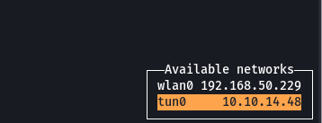

# What for?
I needed a quick way of getting my IPs into clipboard and re-using them elsewhere.

# Install with TPM
See tmux plugin manager for details.

# Requirements
Install `xclip` and `jq` packages.
